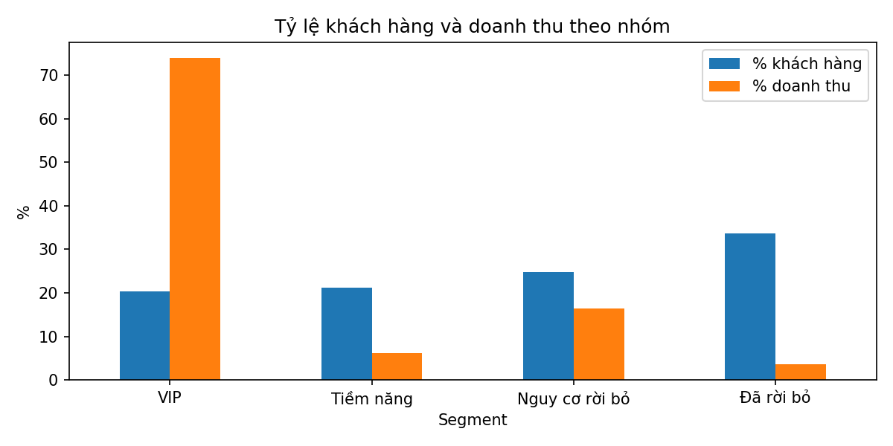
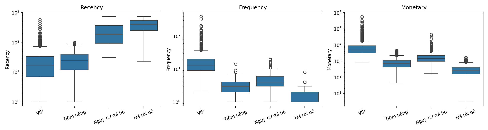

# Phân nhóm khách hàng bằng RFM và K-Means

Dự án phân tích hành vi mua hàng của khách hàng một cửa hàng bán lẻ trực tuyến, dùng Python.

## Dữ liệu
- Nguồn: Online Retail II (UCI Machine Learning Repository), tải từ Kaggle: https://www.kaggle.com/datasets/mashlyn/online-retail-ii-uci
- Giao dịch của một cửa hàng bán lẻ trực tuyến, từ 01/12/2009 đến 09/12/2011
- Dữ liệu thô: 1.067.371 dòng, 8 cột

## Quy trình
1. **Làm sạch dữ liệu:** còn 779.425 dòng (73,0%) của 5.878 khách hàng

| Bước | Số dòng bị loại |
|---|---|
| Thiếu CustomerID | 243.007 |
| Đơn hủy (InvoiceNo bắt đầu bằng "C") | 18.744 |
| Quantity hoặc UnitPrice <= 0 | 71 |
| Dòng trùng lặp | 26.124 |

*Các bước được thực hiện lần lượt, nên số dòng bị loại ở mỗi bước tính trên phần dữ liệu còn lại sau bước trước đó.*

2. **Tính RFM** cho từng khách: Recency, Frequency, Monetary
3. **Xử lý lệch và chuẩn hóa:** log1p, sau đó StandardScaler
4. **Chọn K:** thử K = 2 đến 8 bằng Elbow Method và Silhouette Score, chọn **K = 4** (Silhouette = 0,365)
5. **Phân cụm bằng K-Means** và mô tả từng nhóm

## Kết quả

| Nhóm | % khách | % doanh thu | Đặc điểm |
|---|---|---|---|
| VIP | 20,3% | 73,9% | Mua thường xuyên, chi tiêu cao, mua gần đây |
| Tiềm năng | 21,3% | 6,2% | Mới mua gần đây, chi tiêu vừa |
| Nguy cơ rời bỏ | 24,8% | 16,4% | Từng mua khá nhiều, lâu chưa quay lại |
| Đã rời bỏ | 33,6% | 3,6% | Mua rất ít, rất lâu chưa quay lại |

**Đề xuất:** giữ chân nhóm VIP bằng ưu đãi riêng; khuyến khích nhóm Tiềm năng mua lần kế tiếp; gửi chiến dịch kích hoạt lại cho nhóm Nguy cơ rời bỏ; chỉ dùng kênh chi phí thấp với nhóm Đã rời bỏ.

## Hạn chế
- Silhouette ở mức trung bình; hai nhóm "Nguy cơ rời bỏ" và "Đã rời bỏ" chồng lấn nhau ở Recency.
- Chỉ dùng 3 đặc trưng RFM, chưa xét sản phẩm hay quốc gia.

## Công cụ
Python, Pandas, NumPy, Scikit-learn, Matplotlib, Seaborn (VS Code, Jupyter Notebook)

## Cách chạy lại
Tải dữ liệu từ link ở mục Dữ liệu, đặt vào thư mục `data/` với tên `online_retail_II.csv`, rồi chạy `main.ipynb`.